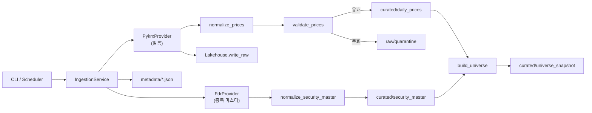

# 전체 파이프라인

모듈·경로 개요는 [프로젝트 구조](/docs/structure.md)를 보세요.



# CLI 진입 → 서비스

```text
market-data backfill|update|validate|serve
        │
        ▼
   Settings(data_dir)
        │
        ├─ backfill / update / serve ──► IngestionService
        └─ validate ───────────────────► Lakehouse.read_curated → validate_prices

market-data fundamentals sync-corp-codes|backfill|update
        │
        ▼
   FundamentalsService  (일봉과 분리, DART_API_KEY)

market-data prices rebuild-adjusted
        │
        ▼
   AdjustedPricesService  (종목별 수정주가 → curated *_adjusted)
```

| 명령 | 호출 | 동작 요약 |
|------|------|-----------|
| `backfill --start --end` | `IngestionService.backfill` | start~end 평일마다 `ingest_day` |
| `update` | `IngestionService.update` | curated 마지막일+1(평일) 1회 수집. 없으면 no-op |
| `validate --date` | `validate_prices` | curated만 읽고 검사. 쓰기 없음 |
| `serve` | `scheduler.serve` | 월–금 18:30 KST에 `update` 반복 |
| `prices rebuild-adjusted` | `AdjustedPricesService.rebuild` | 종목별 수정주가로 `*_adjusted` 채움. `--security-id`, `--limit` |
| `fundamentals sync-corp-codes` | `FundamentalsService.sync_corp_codes` | ticker→`dart_corp_code` 매핑 |
| `fundamentals backfill` | `FundamentalsService.backfill` | 연·보고서별 주요계정 수집. `--skip-existing`(기본 ON), `--reprt-code`, `--limit` |
| `fundamentals update` | `FundamentalsService.update` | 지정 연도 재수집. `--skip-existing` 기본 OFF |

# 수정주가 재구축

일별 ingest는 전 종목 **raw** 시세만 빠르게 쌓습니다. 수정주가는 pykrx 종목별 API(`adjusted=True`)로 따로 받아 curated의 `open/high/low/close_adjusted`를 채웁니다.

```bash
# 단일 종목 (권장 시작)
uv run market-data prices rebuild-adjusted --security-id KRX:005930 --start 2015-01-01

# eligible 마스터 일부
uv run market-data prices rebuild-adjusted --start 2015-01-01 --limit 10
```

기존 다른 종목의 `*_adjusted`는 유지하고, 지정 종목만 덮어씁니다. `adjustment_as_of`에 재구축 일자를 기록합니다. 백테스트 가격 가정은 [토이 백테스트](/docs/backtest.md)를 보세요.

# 재무 파이프라인

일봉 실패/한도와 격리하기 위해 별도 서비스입니다. CFS 우선, 없으면 OFS. 보고서 코드: 11011(사업), 11012(반기), 11013(1분기), 11014(3분기).

연구 시 `attach_latest_fundamentals(prices, accounts)`로 근사 as-of 조인(보고기간 말일 ≤ trade_date). 공시일(`rcept`) 기반 as-of는 후속 보강.

## OpenDART 일일 한도 · 분할 · 재개

OpenDART는 인증키당 일일 요청 한도(보통 ~20,000건, status `020`)가 있습니다. 종목당 CFS(필요 시 OFS) 호출이므로 전 종목 × 연도 × 보고서 4종은 **수일 분량**입니다.

- 파티션 단위는 `bsns_year` / `reprt_code`입니다. 완료된 curated만 디스크에 남고, 진행 중 파티션은 미저장입니다.
- `backfill` 기본 `--skip-existing`: 이미 있는 curated 파티션은 API를 다시 치지 않습니다. 강제 재수집은 `--no-skip-existing`.
- `020`이면 해당 파티션은 쓰지 않고 이후 파티션을 중단합니다(exit 2). 완료분은 유지됩니다.

```bash
uv run market-data fundamentals backfill --start-year 2020 --end-year 2020
uv run market-data fundamentals backfill --start-year 2020 --end-year 2020 --reprt-code 11011
uv run market-data fundamentals backfill --start-year 2020 --end-year 2026
```

## 운영 스케줄 (backfill 이후)

| 용도 | 명령 | 주기 |
|------|------|------|
| 일봉 유지 | `market-data serve` | 상시 프로세스. 평일 18:30 KST에 `update` |
| 일봉 1회 | `market-data update` | 필요 시 수동. `serve`와 중복 등록하지 말 것 |
| 재무 유지 | `market-data fundamentals update` | **분기·공시 후**. 올해 보고서 전 종목 재수집(한도 큼). 매일 비권장 |

# 일별 수집 (`ingest_day`)

핵심 오케스트레이션은 `IngestionService.ingest_day(trade_date)`입니다.

```text
1. IngestionRun 시작 (run_id 발급)
2. security_master 로드
   └─ 비어 있으면 refresh_security_master()
        FdrProvider.get_security_master()
        → normalize_security_master()
        → curated/security_master/current 교체
3. 시장별(KOSPI, KOSDAQ) 반복
   ├─ PykrxProvider.get_daily_prices(trade_date, market)
   ├─ raw/daily_prices/.../source.parquet 저장
   └─ normalize_prices(..., adjusted=False)
4. 시장 프레임 concat
5. validate_prices
   ├─ 유효 행 → combine_raw_and_adjusted
   │              → curated/daily_prices/trade_date=... 교체
   └─ 무효 행 → quarantine → raw/quarantine/...
6. build_universe(prices, master, trade_date)
   → curated/universe_snapshot/as_of_date=... 교체
7. metadata/ingestion_runs/{run_id}.json 기록
8. 품질 이슈 있으면 metadata/quality_results/{run_id}.json 기록
9. 예외 시 status=failed 메타 기록 후 raise
```

## 품질 검사 항목

수집을 중단하지 않고, 문제 행만 curated에서 제외합니다.

| check | 조건 |
|-------|------|
| `duplicate_key` | `(trade_date, security_id)` 중복 |
| `missing_price` | open/high/low/close/volume 결측 |
| `negative_value` | 가격·거래량 음수 |
| `ohlc_range` | low ≤ min(open,close), high ≥ max(open,close), low ≤ high 위반 |

## 유니버스 적격 조건

`eligible = True` 인 종목만 연구 대상입니다.

- `security_type == COMMON`
- `exclusion_reason` 없음
- ETF, ETN, REIT/리츠, 스팩/SPAC, 우선주 등은 마스터 단계에서 `EXCLUDED`
- KOSPI·KOSDAQ 외 시장은 제외

# backfill / update 차이

```text
backfill(start, end)
  day = start … end
  weekday만 ingest_day(day)   # 공휴일은 스킵하지 않음(평일만 필터)

update(today=오늘)
  curated 비어 있음 → ingest_day(today)
  아니면 last = max(trade_date)
       candidate = last+1 이후 첫 평일
       candidate ≤ today → ingest_day(candidate)
       아니면 None (갱신 없음)
```

`serve`는 위 `update`를 cron으로 감싼 형태입니다. 장 마감 후(기본 18:30) 하루 치만 따라잡습니다.

# 저장·조회 흐름

```text
쓰기
  Lakehouse.write_raw              → data/market-data/raw/.../source.parquet
  Lakehouse.replace_curated_partition → data/market-data/curated/.../part-000.parquet
  Lakehouse.write_metadata         → data/market-data/metadata/.../{key}.json

읽기
  Lakehouse.read_curated(dataset)  → 해당 curated 하위 *.parquet 전부 concat
  Catalog.connect()                → DuckDB 뷰 daily_prices / universe_snapshot / security_master
```

curated 파티션은 **교체(replace)** 방식입니다. 동일 `trade_date`로 재수집하면 이전 파티션을 삭제한 뒤 다시 씁니다. raw는 run_id별로 누적 보존됩니다.

# 의존 관계

```text
cli
 └─ ingestion.service
     ├─ providers (pykrx, fdr)
     ├─ transforms (prices, securities, universe)
     ├─ quality (checks, quarantine)
     ├─ storage.Lakehouse
     └─ models.IngestionRun
 └─ ingestion.scheduler  → service.update
 └─ quality.validate_prices + storage.Lakehouse  (validate 전용)
```

투자 조언을 제공하지 않습니다.
