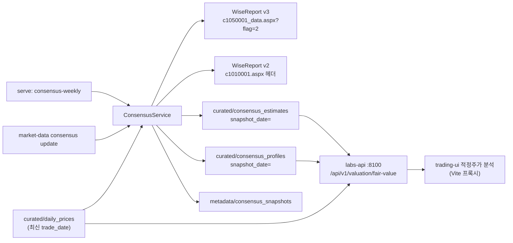

# 가치투자 적정시총·상승여력

2년 후 추정 당기순이익(지배) E에 기준PER을 곱해 적정시총 K를 구하고, 현재 시총 P와 비교해 상승여력 D를 계산합니다.

> K = E × PER  ·  D = (K / P − 1) × 100  (단위: 억원)



## 수집 (`market-data consensus update`)

```bash
uv run market-data consensus update                      # 오늘 날짜 스냅샷
uv run market-data consensus update --limit 5 --data-dir data/market-data/test   # 스모크
```

- **대상:** `daily_prices` 최신 거래일의 시총이 1,200억 이상인 코스피·코스닥 보통주입니다.
  - 시장 구분은 `daily_prices.market`을 기준으로 합니다. `security_master`는 코스닥 글로벌(에코프로비엠·알테오젠 등)을 `outside_target_market`으로 표시하기 때문에, 그 컬럼으로는 거르지 않습니다.
  - `security_master`가 `COMMON`으로 표시한 종목 중 `삼성전자우`처럼 `<본주명>우/우B/2우B/우(전환)` 형태의 우선주는 이름으로 걸러 냅니다.
- **추정 순이익:** WiseReport v3 `c1050001_data.aspx?flag=2`(네이버증권 컨센서스 탭)에서 가져옵니다.
  - `NP`는 지배주주 기준 당기순이익(억원)입니다. 추정치가 없으면 null로 저장합니다.
- **업종·배당:** WiseReport v2 `c1010001.aspx` 헤더의 `WICS`와 `현금배당수익률`입니다.
  - 기준연도+2 추정치가 있는 종목만 요청합니다.
  - 구형 페이지라 파서를 `collector.transforms.consensus.parse_company_profile`에 분리해 두었습니다.
- **스냅샷:** `snapshot_date=YYYY-MM-DD` 파티션으로 누적합니다. 같은 날짜로 다시 실행하면 그 파티션만 교체됩니다.
- **게시 기준:** 컨센서스 요청 실패율이 `Settings.consensus_max_failure_rate`(기본 5%)를 넘거나 파싱된 추정치가 하나도 없으면 `published=false`로 남깁니다. 이때 API는 직전 게시 스냅샷을 계속 씁니다.
  - 같은 날짜에 이미 게시된 스냅샷이 있는데 재실행이 게시 기준에 못 미치면, 게시본을 그대로 두고 실행 기록만 `status=withheld`로 남깁니다. raw는 저장됩니다.
  - 미게시 스냅샷도 같은 curated 데이터셋에 있으므로, 읽을 때는 `latest_published_snapshot()`이나 `metadata/consensus_snapshots`의 `published`를 거쳐야 합니다.
- **업종·배당 실패:** 해당 종목만 직전 게시 스냅샷 값으로 채웁니다(`profile_source=carried_forward`). 이전 값이 없으면 `missing`입니다.
- **요청 예절:** 요청 간격 0.3초, 최대 3회 재시도합니다. 전 종목 1회 실행에 약 10분 걸립니다.

| 데이터셋 | 위치 | 키 컬럼 |
|---|---|---|
| 추정치 | `curated/consensus_estimates/snapshot_date=…` | `security_id, ticker, fiscal_period, fiscal_year, is_estimate, net_income_controlling, fs_basis` |
| 업종·배당 | `curated/consensus_profiles/snapshot_date=…` | `ticker, sector, dividend_yield, profile_as_of, profile_source` |
| 원본 | `raw/consensus_estimates`, `raw/consensus_profiles` | 컨센서스 JSON, v2 헤더 텍스트 |
| 게시 여부 | `metadata/consensus_snapshots/{날짜}.json` | `published, failure_rate, base_year, …` |

## 스케줄

`market-data serve`가 평일 18:30 일봉 갱신과 함께 **주 1회** 컨센서스를 수집합니다. 기본값은 토요일 09:00 KST이고, `Settings.consensus_schedule_day/hour/minute`로 바꿀 수 있습니다.

## 계산 규칙

- **P:** market-data `daily_prices` 최신 거래일의 `market_cap`(원)을 1e8로 나눈 값입니다. 응답의 `price_date`가 그 날짜입니다.
- **기준연도(Y0):** 스냅샷에서 가장 많은 종목의 첫 (E) 연도입니다. 실적이 공시되면 자연스럽게 다음 해로 넘어가며, 컬럼명(26/28 → 27/29)도 함께 바뀝니다.
- **표 포함 조건:** Y2(=Y0+2) 추정치가 있고, 현재 시총이 1,200억 이상인 종목입니다. Y0 추정치가 없으면 Y0 컬럼은 비워 둡니다.
- **음수 E:** 그대로 계산합니다. 그래서 상승여력이 −100%보다 낮을 수 있습니다.

### 기준PER (`config/valuation_per.toml`)

적용 우선순위는 `[stock_per]` 종목 오버라이드 → `[sector_per]` WICS 업종 PER → `default_per`(10)입니다. API가 요청마다 파일을 다시 읽으므로 재시작하지 않아도 반영됩니다.

```toml
default_per = 10

[sector_per]
"반도체와반도체장비" = 12

[stock_per]
"005930" = 12
```

## labs API (`labs-api serve`)

```bash
uv run labs-api serve --data-dir data/market-data        # 127.0.0.1:8100
```

`GET /api/v1/valuation/fair-value`

```json
{
  "base_year": 2026,
  "snapshot_date": "2026-09-26",
  "price_date": "2026-09-25",
  "rows": [
    {"stock_name": "삼성전자", "market": "KOSPI", "ticker": "005930", "market_cap_eok": 16749588,
     "net_income_y0": 3196571.9, "fair_cap_y0": 31965719, "upside_y0": 90.84,
     "net_income_y2": 4744728.4, "fair_cap_y2": 47447284, "upside_y2": 183.27,
     "dividend_yield": 0.58, "sector": "반도체와반도체장비", "base_per": 10}
  ]
}
```

- 행은 `upside_y2` 내림차순으로 정렬되고, 결측값은 `null`입니다.
- 게시된 스냅샷이나 일봉이 없거나, 기준PER TOML이 잘못되었으면 `503`과 안내 메시지를 돌려줍니다.

## trading-ui

- `vite.config.js`가 `/api/v1/valuation`을 `localhost:8100`으로 프록시합니다. 기존 `/api`(trading-agent :8000) 규칙보다 먼저 선언되어 있습니다.
- '적정주가 분석' 메뉴는 `src/views/FairValueScreenerView.jsx`입니다.
  - 계획서 표 순서대로 컬럼을 보여 주고, 8개 컬럼을 정렬할 수 있습니다.
  - 당기순이익(지배) 두 컬럼은 기본으로 숨기고, 토글로 보여 줍니다.

투자 조언을 제공하지 않습니다.
